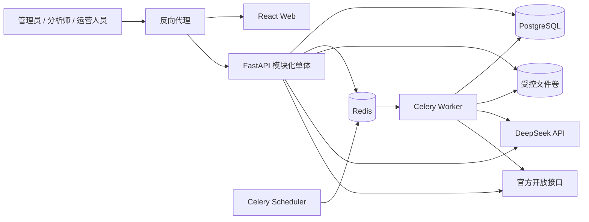
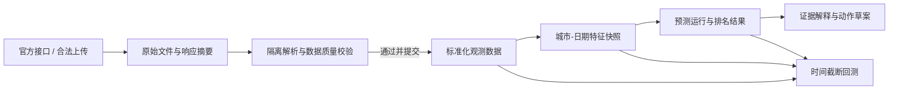

# CityPulse 生产级平台设计

> 文档状态：已确认设计，待书面复核  
> 设计日期：2026-08-15  
> 首发环境：macOS 本地开发；Linux + Docker Compose 生产部署  
> 实施范围：单组织、模块化单体、Web 管理平台

## 0. 设计结论与边界

CityPulse 首版建设为一个面向旅游趋势分析与运营决策的生产级 Web 平台。平台只使用官方开放接口以及分析师合法取得并主动上传的数据，通过可追溯的数据快照计算城市趋势，使用历史时间截断回测验证方法，再由 DeepSeek 基于结构化证据生成经营动作草案。

本设计对现有静态原型做三项关键纠偏：

1. **趋势分与行动优先级分离**：趋势分只表达弱信号相对自身基线的升温程度；行动优先级同时考虑证据完整度、供给承载力、风险压力和业务时效。
2. **未完成概率校准前不展示“爆发概率”**：当前样例中的 `confidence` 只是人工公式产生的演示字段，不能迁移为任何生产置信结论；生产页面改为展示重新计算的“证据完整度”和“数据质量等级”。只有通过严格时间外验证与校准验收后，才能启用“校准概率”。
3. **模拟数据与生产数据强隔离**：现有候选城市、排名、分数和回测曲线均保留为演示工作区，必须持续显示“模拟数据/方法演示”标识，不能进入生产榜单、生产指标或经营动作审批流程。

### 0.1 术语说明

| 术语 | 定义 | 为什么重要 |
|---|---|---|
| 趋势分（Trend Score） | 0-100 的排序分，衡量城市在指定预测窗口内相对自身季节基线的异常升温程度 | 用于发现“将火”而不是复述绝对热度 |
| 行动优先级（Action Priority） | 综合趋势、时效、证据、供给和风险后得到的经营处置等级 | 避免趋势高但不可执行的城市被直接投放 |
| 证据完整度（Evidence Coverage） | 必需证据类型中，满足来源、时间和质量要求的比例 | 它不是概率，只表示证据链是否充分 |
| 校准概率（Calibrated Probability） | 经时间外样本验证后，与真实发生频率一致的概率估计 | 未通过校准验收前不得展示 |
| `available_at` | 一条数据在当时真正可被系统使用的时间 | 防止回测读取未来信息 |
| 时间截断回测 | 在历史截点只读取当时已经可获得的数据，重建预测并评估 | 使提前量与命中指标可复现 |
| RBAC | 基于角色的访问控制，通过角色限定页面、接口和操作权限 | 降低误操作和越权风险 |
| 结构化经营动作 | 由固定 JSON Schema 约束的运营建议，包含目标、窗口、证据、风险与负责人 | 便于校验、审计、人工编辑和后续系统对接 |

### 0.2 本期目标

- 提供登录、总览、数据中心、预测、城市详情、经营动作、回测、任务中心和系统管理九类页面。
- 跑通“数据接入 -> 校验 -> 特征快照 -> 趋势排序 -> 证据解释 -> 动作草案 -> 人工审核 -> 回测验证”的闭环。
- 支持管理员、分析师、运营人员三类角色，并对关键操作记录审计日志。
- 支持 CSV/XLSX 导入和官方开放接口适配，所有数据保留来源、时间与版本。
- 使用 DeepSeek 生成结构化动作；模型不可用、超时或输出不合格时，自动使用确定性规则模板降级。
- 在当前 macOS 环境可一键启动，同时交付可在 Linux 服务器运行的 Docker Compose 配置。

### 0.3 明确不做

- 不抓取违反网站服务条款的数据，不采集或存储个人搜索、位置、订单等身份级数据。
- 不在首版接入去哪儿内部数据，也不暗示已获得相应授权。
- 不让大模型直接决定城市趋势分、修改事实字段或绕过人工审批发布经营动作。
- 不在首版实现多租户、移动端原生应用、自动在线训练、自动广告投放或自动采购。
- 不把当前 3 个正例、2 个对照样例和 `Hit@5` 演示结果当成有效模型成绩。

---

## 第一章：产品范围与用户工作流

### 1.1 用户与职责

| 角色 | 核心职责 | 可执行操作 | 禁止操作 |
|---|---|---|---|
| 管理员 | 用户、角色、数据源、模型配置和系统运行管理 | 管理账号与权限；配置数据源和 DeepSeek；查看全部任务与审计；重试或取消任务 | 不能绕过数据校验直接写入生产结果 |
| 分析师 | 数据治理、特征检查、预测与回测 | 上传并提交数据；触发特征、预测和回测任务；查看证据；发起动作生成 | 不能管理用户；不能代表运营批准动作 |
| 运营人员 | 研判候选城市并管理经营动作 | 查看榜单和城市证据；编辑、批准、驳回、归档动作草案 | 不能上传数据、修改模型配置或伪造预测结果 |

管理员拥有业务页面的只读查看能力，但涉及分析结论或运营审批的动作仍以对应角色身份记录，不使用无来源的“超级操作”。首版为单组织系统，一个用户可以拥有一个或多个角色；所有写操作由服务端再次鉴权，不能只依赖前端隐藏按钮。

### 1.2 关键工作流

#### 工作流 A：数据接入与发布

1. 分析师选择官方数据源同步，或上传合法取得的 CSV/XLSX 文件。
2. 系统先保存文件元数据与 SHA-256 摘要，再进入隔离校验区，不直接写入生产业务表。
3. 后台任务校验文件类型、字段、编码、日期、城市编码、数值范围、重复记录和时间逻辑。
4. 数据中心展示错误行、警告项、覆盖日期、城市数和来源声明。
5. 全部阻断错误修复后，分析师执行“提交数据集”；系统以事务方式写入标准化表，并生成不可变数据版本。
6. 提交成功后触发受影响日期和城市的特征快照重算；重复提交同一摘要时返回已有结果，不产生重复数据。

#### 工作流 B：预测与研判

1. 分析师选择数据版本、评分版本、预测窗口和城市范围，创建预测运行。
2. 后台任务生成特征快照并计算趋势分、风险压力、证据完整度和行动优先级。
3. 成功结果作为不可变运行版本发布；失败运行保留错误阶段和可重试信息，不覆盖上一次成功结果。
4. 运营人员在预测页筛选榜单，进入城市详情核对趋势、来源证据、风险和数据新鲜度。
5. 低证据、数据过期或高风险结果只能进入观察池，不能直接生成高优先级动作。

#### 工作流 C：经营动作

1. 分析师或运营人员从已发布预测结果发起动作生成。
2. 系统整理经过许可的结构化输入，调用 DeepSeek，并使用 JSON Schema 校验返回结果。
3. 调用失败或结果校验失败时，使用规则模板生成可编辑草案，并明确标记生成方式和降级原因。
4. 运营人员核对证据引用后编辑草案，提交审核并批准或驳回。
5. 首版审批只改变平台内状态，不自动向广告、采购、库存或第三方业务系统下发。

#### 工作流 D：历史回测

1. 分析师定义案例、公开爆发日 `T0`、截点、正例/对照组、数据版本和评分版本。
2. 系统按 `available_at <= cutoff_at` 重建每个截点的数据快照。
3. 后台计算 `Hit@K`、`NDCG@K`、提前量、误报率、证据覆盖率；存在校准模型时再计算 Brier Score 和 ECE。
4. 结果绑定数据、特征、评分、代码和随机种子版本，支持导出可复现实验清单。
5. 演示数据的结果始终带有醒目标识，并排除在生产质量看板之外。

### 1.3 页面信息架构

| 路由 | 页面 | 主要内容 | 主要角色 |
|---|---|---|---|
| `/login` | 登录 | 账号密码、登录错误、会话过期提示 | 全部 |
| `/overview` | 总览 | 最新数据时间、候选城市、观察池、待审批动作、失败任务、质量告警 | 全部已登录用户 |
| `/data` | 数据中心 | 数据源、上传、校验报告、数据版本、字段映射、来源声明 | 管理员、分析师 |
| `/predictions` | 预测 | 运行选择、7/14/30 天窗口、趋势榜单、行动等级、筛选与导出 | 全部已登录用户 |
| `/cities/:cityId` | 城市详情 | 趋势、因素、证据时间线、风险、数据新鲜度、历史运行对比 | 全部已登录用户 |
| `/actions` | 经营动作 | 草案生成、证据引用、人工编辑、审核状态、导出 | 运营人员、分析师；管理员只读 |
| `/backtests` | 回测 | 案例配置、运行状态、指标、曲线、基线对比、复现实验信息 | 管理员、分析师 |
| `/jobs` | 任务中心 | 数据同步、导入、特征、预测、回测、AI 生成任务状态与错误 | 管理员、分析师；运营查看关联 AI 任务 |
| `/admin` | 系统管理 | 用户角色、数据源、模型配置、阈值、审计日志、系统健康 | 管理员 |

每个业务页面必须具备加载、空数据、权限不足、局部失败和最后更新时间状态。表格支持分页、排序和条件筛选；导出内容携带当前筛选条件、数据版本、生成时间和真实性声明。

### 1.4 状态定义

| 对象 | 状态流转 | 约束 |
|---|---|---|
| 数据集 | `uploaded -> validating -> valid/invalid -> committed -> archived` | `committed` 后内容不可变，修订必须新建版本 |
| 后台任务 | `queued -> running -> succeeded/failed/cancelled` | 只允许重试失败任务；重试生成新尝试记录 |
| 预测运行 | `queued -> running -> succeeded/failed` | 只有 `succeeded` 可被业务页面选为当前版本 |
| 动作方案 | `draft -> pending_review -> approved/rejected`；任一终态可归档；修改已批准或已驳回方案时创建新的 `draft` 版本 | 只有运营人员可批准；历史版本和审批记录不可覆盖 |
| 回测运行 | `queued -> running -> succeeded/failed` | 指标与输入版本绑定，不能手工修改数值 |

---

## 第二章：系统架构与模块边界

### 2.1 架构选择

采用**模块化单体**：前后端分离部署，后端在一个 FastAPI 应用和一个代码库内按领域模块拆分，异步任务由同一业务代码包中的 Celery Worker 执行。该方案能保持部署简单、事务边界清晰，并为后续按负载拆分服务保留接口，而不会在数据量和团队规模尚未证明前引入微服务成本。

| 方案 | 优点 | 成本与风险 | 结论 |
|---|---|---|---|
| 模块化单体 | 本地启动简单；事务一致；共享类型和测试成本低 | 需要严格维护模块边界 | **首版采用** |
| 多服务架构 | 可独立扩缩、独立部署 | 运维、链路追踪和数据一致性成本高 | 数据规模或团队边界明确后再评估 |
| 纯无后端静态应用 | 演示快、部署轻 | 无法满足权限、任务、审计、持久化和安全要求 | 仅保留现有原型作为视觉参考 |

### 2.2 技术栈

| 层级 | 选型 | 职责 |
|---|---|---|
| Web 前端 | React + TypeScript | 页面、交互、权限导航、图表、表单和任务状态展示 |
| API 后端 | FastAPI | 认证鉴权、业务接口、事务、校验、领域服务和审计 |
| 主数据库 | PostgreSQL | 用户、城市、标准化信号、版本、预测、回测、动作和审计元数据 |
| 缓存与消息代理 | Redis | Celery 队列、短期缓存、限流计数和任务锁 |
| 异步执行 | Celery Worker + Scheduler | 接口同步、文件解析、特征计算、预测、回测和 AI 生成 |
| 文件存储 | 开发期本地受控目录；部署期挂载持久卷 | 保存原始上传、校验报告和导出文件；数据库只存元数据和摘要 |
| 部署 | Docker Compose | 编排 Web、API、Worker、Scheduler、PostgreSQL、Redis 和反向代理 |

首版不引入 Kubernetes、独立特征平台或独立模型服务。文件存储通过内部接口封装，未来确有多实例需求时再切换到 S3 兼容对象存储。

### 2.3 运行拓扑

浏览器只访问同源反向代理；PostgreSQL、Redis 和 Worker 不对公网暴露端口。生产环境通过 TLS 终止访问，开发环境可以使用 `localhost` 明文 HTTP。

### 2.4 后端领域模块

| 模块 | 单一职责 | 主要依赖 | 对外能力 |
|---|---|---|---|
| `identity` | 用户、密码、会话、角色和权限 | PostgreSQL、Redis | 登录、退出、当前用户、用户管理 |
| `city_catalog` | 行政区划、城市别名和版本 | PostgreSQL、官方行政区划源 | 城市查询、实体解析 |
| `data_source` | 数据源配置、域名白名单和同步策略 | PostgreSQL、HTTP 客户端 | 数据源管理、同步触发 |
| `ingestion` | 文件上传、解析、字段映射、质量校验和提交 | 文件卷、PostgreSQL、Celery | 上传、预检、校验报告、版本发布 |
| `evidence` | 证据项、来源、发布时间和可用时间 | PostgreSQL | 证据查询、覆盖率计算 |
| `feature` | 城市日期特征快照及血缘 | PostgreSQL、Celery | 快照构建、版本查询 |
| `prediction` | 评分版本、预测运行、趋势排序和行动优先级 | `feature`、`evidence` | 发起运行、榜单、城市结果 |
| `backtest` | 时间截断、案例、基线和指标 | `prediction`、Celery | 回测运行、指标和复现清单 |
| `action_plan` | DeepSeek 调用、规则降级、动作版本与审批 | `prediction`、`evidence` | 生成、编辑、审核、导出 |
| `job` | 异步任务、进度、重试、取消和运行日志摘要 | Redis、Celery、PostgreSQL | 任务列表和控制 |
| `audit` | 关键读写操作的追加式审计 | PostgreSQL | 审计检索与导出 |
| `system` | 健康检查、运行配置和版本信息 | 全局只读依赖 | 健康、就绪、配置摘要 |

模块之间通过应用服务和明确的数据传输对象调用，不能跨模块直接修改对方表。`prediction` 可以读取已发布特征与证据，但不能修改原始数据；`action_plan` 只能读取已发布预测，不能回写趋势分。

### 2.5 前端模块

- `app-shell`：路由、会话恢复、权限守卫、导航和全局错误边界。
- `auth`：登录、退出、会话过期处理。
- `overview`：关键状态与告警聚合。
- `data-center`：上传、校验、版本与数据源管理。
- `prediction`：运行选择、榜单、城市详情和证据展示。
- `action-plan`：结构化动作编辑、版本对比与审批。
- `backtest`：实验配置、指标与曲线。
- `jobs`：实时轮询任务进度、错误摘要与重试入口。
- `admin`：用户、角色、配置和审计。
- `shared`：API 客户端、类型、表格、表单、图表、日期和错误展示。

页面不直接拼接 URL 或猜测服务端状态；统一通过类型化 API 客户端访问。服务端权限拒绝是最终依据，前端守卫只改善交互体验。

### 2.6 API 约定

- 业务接口统一位于 `/api/v1`，使用 JSON；文件上传使用 `multipart/form-data`。
- 列表统一使用游标或页码分页，并返回总数、当前筛选和排序信息。
- 错误统一包含 `code`、`message`、`request_id` 和可选 `field_errors`，不向客户端暴露栈信息。
- 创建预测、回测、导入和 AI 生成任务时支持幂等键；重复请求返回既有任务。
- 所有响应时间使用带时区的 ISO 8601 格式，数据库统一存 UTC，界面按 `Asia/Shanghai` 展示。
- 写操作校验 `Content-Type`、请求大小、CSRF Token、会话和权限；关键操作写入审计日志。
- `/health/live` 只表示进程存活，`/health/ready` 检查数据库和 Redis 是否可用，不泄漏凭据或内部地址。

核心资源接口包括：

| 资源 | 代表性接口 |
|---|---|
| 会话 | `POST /api/v1/auth/login`、`POST /api/v1/auth/logout`、`GET /api/v1/auth/me` |
| 数据集 | `POST /api/v1/datasets`、`POST /api/v1/datasets/{id}/validate`、`POST /api/v1/datasets/{id}/commit` |
| 数据源 | `GET /api/v1/data-sources`、`POST /api/v1/data-sources/{id}/sync` |
| 预测 | `POST /api/v1/prediction-runs`、`GET /api/v1/prediction-runs/{id}/results` |
| 城市 | `GET /api/v1/cities/{id}/trend`、`GET /api/v1/cities/{id}/evidence` |
| 动作 | `POST /api/v1/action-plans`、`PATCH /api/v1/action-plans/{id}`、`POST /api/v1/action-plans/{id}/approve` |
| 回测 | `POST /api/v1/backtest-runs`、`GET /api/v1/backtest-runs/{id}` |
| 任务 | `GET /api/v1/jobs`、`POST /api/v1/jobs/{id}/retry`、`POST /api/v1/jobs/{id}/cancel` |
| 管理 | `GET /api/v1/admin/users`、`GET /api/v1/admin/audit-logs` |

---

## 第三章：数据、评分、回测与 AI 设计

### 3.1 数据来源政策

平台只允许两类来源：

1. **官方开放接口**：由管理员配置，必须启用 HTTPS、请求超时、重试上限、速率限制和目标域名白名单；密钥只保存在服务端环境变量或密钥文件中。
2. **分析师上传**：分析师需选择来源类型、填写来源名称、数据日期、授权或公开依据，并确认不含个人敏感信息。平台接受 CSV 和 XLSX，拒绝宏工作簿、压缩包和其他格式。

首批适配方向包括官方行政区划、POI、天气、路径规划、公开文旅统计和公开事件日历。没有合法接口或稳定授权的数据源不得以爬虫替代。

### 3.2 数据分层与血缘

每一层均保存上游版本引用。任何生产结果必须能追溯到：数据源、原始摘要、数据集版本、字段映射、城市主数据版本、特征版本、评分版本、运行参数和代码版本。

### 3.3 核心数据实体

| 实体 | 关键字段 | 约束 |
|---|---|---|
| `users` / `roles` / `user_roles` | 用户状态、密码摘要、角色、最后登录 | 密码只存 Argon2id 摘要；禁用用户的会话立即失效 |
| `cities` / `city_aliases` | 行政区划代码、名称、省份、有效期、别名 | 业务事实引用稳定城市 ID，不直接依赖名称 |
| `data_sources` | 类型、白名单域名、启用状态、合规说明 | 密钥不进入数据库明文字段和日志 |
| `datasets` / `dataset_files` | 来源、SHA-256、状态、覆盖范围、创建人 | 已提交版本不可变；原文件路径不由客户端控制 |
| `signal_observations` | 城市、日期、指标、数值、来源、观察时间、可用时间 | 唯一键防止同版本重复；值域和时间逻辑受约束 |
| `evidence_items` | 城市、类型、标题、官方 URL、`published_at`、`observed_at`、`available_at` | 来源 URL 必须通过白名单校验 |
| `feature_snapshots` | 城市、日期、窗口、特征 JSON、血缘、质量标记 | 同一版本和参数产生确定性结果 |
| `scoring_versions` | 权重、阈值、算法标识、状态 | 发布后不可改，变更产生新版本 |
| `prediction_runs` / `prediction_results` | 输入版本、窗口、趋势分、风险、证据完整度、行动优先级 | 运行成功后结果不可变 |
| `backtest_cases` / `backtest_runs` / `backtest_metrics` | `T0`、截点、样本类型、版本、指标 | 演示和生产评测分区统计 |
| `action_plans` / `action_plan_versions` | 预测引用、生成方式、动作 JSON、审核状态 | 每次修改形成版本；审批人与时间必填 |
| `jobs` / `job_attempts` | 类型、状态、进度、幂等键、错误码 | 任务失败不回滚已有成功版本 |
| `audit_logs` | 操作人、动作、对象、前后摘要、IP、请求 ID、时间 | 追加写入，业务接口无删除能力 |

数据库仅保存结构化结果和文件元数据。原始文件、校验报告和导出文件保存在服务端生成名称的受控目录中，禁止以用户文件名拼接路径。

### 3.4 数据质量规则

阻断性错误包括：

- 文件扩展名、MIME 类型或文件签名不一致；文件超过配置上限；工作表或单元格数量超过上限。
- 缺少必填字段、字段类型错误、城市无法唯一映射、日期无效、数值非有限数或超出约定范围。
- `available_at` 早于不合理的来源时间，或回测输入缺少 `available_at`。
- 同一数据集内主键重复、同一版本重复提交、来源声明缺失。
- 检测到公式、外部链接、宏或可能导致表格公式注入的导出值。

警告项包括：数据时间覆盖不连续、部分指标缺失、来源新鲜度不足、城市映射依赖别名、异常值偏离历史分布。警告不一定阻断提交，但必须进入数据质量报告并影响证据完整度。

### 3.5 评分分层

生产逻辑不直接沿用静态演示中“正向信号加权后扣风险”的单一分数，而拆为三个独立输出：

1. **趋势分**：只由内容、需求、事件、新奇度、跨区域扩散、可达性和季节基线异常等趋势信号构成。透明基线先使用版本化权重，后续可替换为变点检测或学习排序，但输出始终是排序分而非概率。
2. **风险压力**：由供给不足、价格波动、天气与安全预警、拥挤和负面事件独立计算，保留分项原因。
3. **行动优先级**：根据趋势分、证据完整度、数据新鲜度、供给承载力、风险压力和行动窗口映射为 `high`、`medium`、`watch`、`blocked`。

默认决策规则采用可配置阈值，并满足以下硬约束：

- 证据完整度低于发布阈值时最高只能为 `watch`。
- 任一安全类阻断风险生效时必须为 `blocked`。
- 数据超过新鲜度上限时不得为 `high`。
- 趋势分高但供给不足时不得通过简单扣分掩盖风险，必须在结果中单列原因。
- 阈值调整只影响新运行；历史运行继续使用原评分版本。

现有回测曲线中的 68 分线只用于解释静态演示的首次越阈时间，不作为生产行动阈值。生产阈值必须分别作用于趋势、证据、风险和行动优先级，并随评分版本保存。

现有 `src/scoring.py` 作为透明基线和数据合同验证工具保留。生产实现应复用其已确认权重作为首个评分版本的候选输入，但必须先完成上述语义拆分，并通过回归测试证明榜单变化可解释。

### 3.6 概率启用门槛

在以下条件全部满足前，接口和页面不得使用 `probability`、`爆发概率` 或百分比概率文案：

- 有足够的独立历史正例和匹配对照，样本不再局限于当前演示案例。
- 训练、调参与测试严格按时间前滚，测试时间段未参与模型或阈值选择。
- 使用 Platt 或 Isotonic 等方法完成校准，并报告 Brier Score、ECE、可靠性曲线和样本量。
- 在至少一个完整时间外评测窗口中，校准表现优于未校准基线，且结果由管理员发布为新的评分版本。
- 页面、接口、导出和动作提示均能显示模型版本、适用窗口和已知限制。

在此之前，现有 `confidence` 值只作为 `legacy_demo_confidence` 保留在演示工作区且默认不展示。`evidence_coverage` 必须根据必需证据类型和质量规则重新计算，禁止把旧值直接复制或只改字段标签。

### 3.7 回测协议

回测继承现有 `docs/backtest_protocol.md`，并增加生产约束：

- 截点查询统一使用 `available_at <= cutoff_at`，不能依据当前数据库状态倒推历史。
- 训练、特征构建、阈值选择、预测和指标计算分别记录版本。
- 正例与对照组在运行前冻结；案例变更产生新版本，不能覆盖原结果。
- `Hit@5` 在候选城市少于 6 个时只作为描述性结果，不作为模型区分能力证据。
- 至少同时报告一个排序指标、一个提前量指标、一个误报指标和证据覆盖指标。
- 未启用校准概率时不计算或不展示概率校准指标，避免空洞占位。
- 目标门槛与实际结果分栏展示；当前 `Hit@5 >= 60%`、平均提前量 `>= 7 天`、证据覆盖率 `>= 90%` 仍是迭代目标，不是已有成绩。

### 3.8 DeepSeek 动作生成

DeepSeek 只接收经过服务端选择的结构化字段：城市、窗口、趋势因素、风险分项、证据摘要、来源引用、供给信息和业务约束。不得发送密码、密钥、用户上传原文中的个人信息、内部日志或未经授权的全文内容。

动作输出使用固定 Schema，至少包含：

| 字段 | 含义 | 校验要求 |
|---|---|---|
| `city_id` / `prediction_result_id` | 动作对应的城市和预测版本 | 必须与请求一致，模型不能改写 |
| `target_segment` | 建议客群 | 枚举或受控短文本 |
| `action_window` | 建议开始与结束日期 | 必须落在预测窗口和业务约束内 |
| `product_bundle` | 交通、住宿、景点或内容组合 | 每项包含类型、理由和优先级 |
| `campaign_theme` | 投放主题 | 不得包含无法由证据支持的事实断言 |
| `supply_actions` | 备供与风险缓解动作 | 高风险结果必须给出限制条件 |
| `evidence_refs` | 引用的证据 ID | 必须属于当前预测快照，且能在数据库中解析 |
| `assumptions` | 明确假设 | 不得伪装成已验证事实 |
| `risk_notes` | 风险与停止条件 | `high` 和 `blocked` 风险必须显式反映 |

服务端按以下顺序处理：输入脱敏与长度限制 -> 模板和模型版本绑定 -> 调用超时与有限重试 -> JSON 解析 -> Schema 校验 -> 证据 ID 校验 -> 业务规则校验 -> 保存草案。任一步失败即调用确定性规则模板；不会把不完整模型文本直接展示为正式动作。

规则降级模板基于行动优先级生成：`high` 给出“立即人工研判与备供”，`medium` 给出“小范围验证”，`watch` 给出“继续观察与补证据”，`blocked` 只给出风险处置和停止条件。所有降级草案标记 `generator_type=rule_fallback` 及原因。

---

## 第四章：权限、安全、可靠性与交互要求

### 4.1 权限矩阵

| 能力 | 管理员 | 分析师 | 运营人员 |
|---|---:|---:|---:|
| 查看总览、预测和城市详情 | 是 | 是 | 是 |
| 上传、校验、提交数据 | 只读/配置 | 是 | 否 |
| 触发预测和回测 | 查看/取消异常任务 | 是 | 否 |
| 生成动作草案 | 查看 | 是 | 是 |
| 编辑动作草案 | 查看 | 是 | 是 |
| 批准或驳回动作 | 否 | 否 | 是 |
| 管理用户、角色和数据源 | 是 | 否 | 否 |
| 查看完整审计日志 | 是 | 仅本人相关记录 | 仅本人相关记录 |

涉及数据提交、运行取消、动作批准、用户禁用和配置变更的接口需要二次确认，并在审计记录中保存对象版本、操作者、结果和请求 ID。

### 4.2 认证与会话

- 密码使用 Argon2id 哈希，并配置最小长度、常见弱密码拒绝和登录失败限流。
- 浏览器使用服务端会话和 `HttpOnly`、`Secure`、`SameSite=Lax` Cookie，不把访问令牌存入 `localStorage`。
- 所有状态变更请求使用 CSRF Token；登录成功后轮换会话 ID，退出、改密、禁用用户时服务端撤销会话。
- 会话具有闲置超时和绝对超时，默认分别为 30 分钟和 12 小时，管理员可在受控范围内配置。
- 登录错误使用统一提示，避免泄漏账号是否存在；密码、会话、API 密钥不得写入日志。

### 4.3 上传与外部访问安全

- 默认单文件上限 20 MiB；CSV 最大 200,000 行；XLSX 最大 10 个工作表、每表 100,000 行，部署时可下调。
- 同时校验扩展名、MIME 类型和文件签名；只接受 `.csv`、`.xlsx`，明确拒绝 `.xlsm`、`.xlsb`、`.xls`、压缩包和嵌套文件。
- XLSX 解析禁用外部实体与外部链接，公式按不可信内容处理；导出 CSV 对以 `= + - @` 开头的单元格加安全前缀。
- 文件保存名由服务端生成，原文件名只作为经过清理的展示元数据。
- 外部 HTTP 客户端只访问管理员配置的 HTTPS 域名白名单，解析后阻止回环、链路本地和私有网络地址，限制重定向次数和响应大小，防止 SSRF。
- DeepSeek 与官方接口使用独立超时、并发和速率限制；错误响应只保存必要摘要，不保存密钥或完整敏感请求。
- 登录、上传、任务创建、导出和 AI 生成分别设置按用户与来源 IP 的限流；触发时返回 `429` 和 `Retry-After`，限流参数通过受审计配置管理。
- Web 与 API 采用同源部署，生产环境默认不开放跨域请求；反向代理设置 CSP、HSTS、`X-Content-Type-Options` 和合理的 `Referrer-Policy`。
- DeepSeek 输出和上传内容均按纯文本渲染；确需 Markdown 时先经过允许列表清洗，任何页面都不执行原始 HTML、公式或外部脚本。

### 4.4 审计与数据保留

审计事件至少覆盖登录成功/失败、退出、用户和角色变更、数据源变更、上传、数据提交、预测/回测发起与取消、AI 生成、动作编辑与审批、导出和阈值变更。

默认保留策略：原始上传文件 90 天、普通应用日志 30 天、审计日志 365 天；标准化业务版本在管理员明确归档前保留。清理任务只删除到期文件和非审计日志，先记录清理清单并保留数据库元数据。生产部署前应根据实际合规要求调整保留期。

### 4.5 错误处理与降级

| 故障 | 用户可见行为 | 系统处理 |
|---|---|---|
| PostgreSQL 不可用 | 页面显示服务暂不可用，不展示过期写入成功 | 就绪检查失败，拒绝新任务，保留请求 ID |
| Redis/Worker 不可用 | 查询仍可读；创建任务明确失败或排队不可用 | 不伪造任务成功，恢复后由用户重试 |
| 官方接口超时/限流 | 数据源显示失败时间和下次允许重试时间 | 指数退避、有限重试、熔断；保留上次成功版本 |
| 上传校验失败 | 展示错误行和修复建议 | 隔离数据不进入标准化表 |
| 预测任务失败 | 继续展示上一次成功版本并明确其时间 | 当前运行标记失败，不覆盖旧结果 |
| DeepSeek 失败 | 动作草案显示“规则模板生成” | 有限重试后降级，记录错误类别 |
| 部分图表失败 | 其余页面保持可用，显示局部错误 | 前端错误边界记录请求 ID，允许重试 |

### 4.6 可观测性

- API 和 Worker 使用结构化日志，统一包含时间、级别、服务、请求 ID、用户 ID 摘要、任务 ID、模块、耗时和错误码。
- 指标至少覆盖 API 请求量/延迟/错误率、队列深度、任务成功率/耗时、数据源新鲜度、导入质量、DeepSeek 调用成功率与降级率。
- 总览页展示业务级告警；任务中心展示可操作错误；基础设施告警通过部署环境日志或监控系统接入，不写死特定供应商。
- 每个预测、回测和动作结果显示生成时间、输入版本、算法/模型版本和真实性标识。
- `/health/live`、`/health/ready` 和版本接口用于容器健康检查与发布核验。

### 4.7 前端交互与可访问性

- 桌面端优先，支持 1280px 及以上高密度工作台；在窄屏下导航折叠，表格允许横向滚动，不让文本与操作按钮重叠。
- 状态不只依赖颜色，同时提供文字和图标；键盘可以完成登录、筛选、上传、表格操作和审批。
- 所有输入有可见标签和字段级错误；高风险、审批和取消操作使用明确确认对话框。
- 图表同时提供摘要、图例、数值提示和可导出的表格数据。
- 不在页面中硬编码候选数量、分数或置信度。现有原型“行动候选 3/工作簿 2”以及“延吉 78%/样例约 91%”的不一致，通过统一读取版本化 API 根治。
- 模拟工作区使用持续可见的横幅、水印和导出声明；生产工作区不允许导入演示结果作为已发布数据。

---

## 第五章：测试、部署、验收与实施边界

### 5.1 测试策略

| 层级 | 覆盖重点 | 必须验证的示例 |
|---|---|---|
| 单元测试 | 领域规则、值域、状态机、权限、评分、时间处理 | 风险阻断、证据阈值、版本不可变、`available_at` 边界 |
| 数据质量测试 | CSV/XLSX 解析、字段映射、城市解析、重复和异常值 | BOM、空值、错误日期、超大文件、公式与重复摘要 |
| 集成测试 | PostgreSQL、Redis、Celery、文件卷和事务 | 导入提交原子性、任务重试幂等、失败不覆盖成功版本 |
| API 契约测试 | 请求/响应 Schema、错误码、分页和鉴权 | 三类角色的允许/拒绝矩阵、统一错误格式 |
| 前端组件测试 | 表单、表格、状态、权限守卫和错误边界 | 空状态、校验报告、审批确认、过期会话 |
| 端到端测试 | 用户关键路径 | 登录 -> 上传 -> 校验 -> 提交 -> 预测 -> 动作 -> 审批；回测完整链路 |
| 安全测试 | 会话、CSRF、上传、SSRF、越权、限流和日志脱敏 | 跨角色接口访问、恶意文件名、私网 URL、重复登录失败 |
| 部署测试 | 容器启动、迁移、健康检查、备份恢复 | 全新环境启动、滚动重启、数据库恢复后数据一致 |

评分测试使用固定快照作为黄金样本，验证当前 `src/scoring.py` 对 10 个候选城市的可复现结果；生产语义拆分后新增独立的趋势分、风险和行动优先级夹具，不能用更新黄金文件掩盖非预期变化。

### 5.2 性能与容量验收目标

首版容量基线为 50-300 个城市、180 天以上日粒度数据、并发登录用户不超过 50。以下是单实例标准部署的验收目标，不代表当前仓库已达到：

| 场景 | 目标 |
|---|---|
| 普通只读 API | 在基线数据量下 p95 小于 500 ms |
| 总览和预测首屏 | 缓存命中后核心数据 p95 小于 2 s |
| 20 MiB 合法文件上传 | 请求可成功接收，解析异步执行，不阻塞 API Worker |
| 后台任务状态 | 最迟 5 s 内在任务中心可见 |
| 任务可靠性 | 同一幂等键不产生重复业务结果；Worker 重启后任务可恢复或明确失败 |
| 数据恢复 | 每日备份可恢复到新的 PostgreSQL 实例，并通过版本与行数校验 |

如真实数据量超过该基线，先基于慢查询、队列耗时和文件解析指标定位瓶颈，再决定增加索引、分区、Worker 或拆分服务。

### 5.3 Docker Compose 部署

标准 Compose 包含：

- `web`：构建后的 React 静态资源。
- `api`：FastAPI 应用，仅通过反向代理暴露。
- `worker`：执行导入、特征、预测、回测和 AI 任务。
- `scheduler`：触发计划同步和清理任务，确保单实例运行。
- `postgres`：持久化数据库，启用健康检查和持久卷。
- `redis`：队列与缓存，启用健康检查和持久化策略。
- `proxy`：同源路由、TLS、请求大小限制和安全响应头。

macOS 本地开发可使用 Docker Desktop Compose，也允许前后端进程直接运行并连接容器中的 PostgreSQL/Redis。Linux 生产环境使用同一镜像和 Compose 文件，通过环境文件覆盖域名、端口、资源限制和密钥。

### 5.4 配置、迁移与发布

- `.env.example` 只列键名和安全示例，不提交真实数据库密码、Cookie Secret、DeepSeek Key 或官方接口密钥。
- 配置启动时完成类型和值域校验；生产模式发现默认密钥、调试模式或不安全 Cookie 配置时拒绝启动。
- 数据库 Schema 通过版本化迁移管理；应用启动不隐式修改生产表。
- 发布顺序为：备份 -> 运行兼容性检查 -> 执行迁移 -> 启动 API/Worker -> 检查就绪 -> 前端切换 -> 冒烟测试。
- 回滚优先回退应用镜像；涉及不可逆数据迁移时必须提供前向修复或经验证的备份恢复步骤。
- 每日数据库备份与文件卷备份分开执行，至少定期完成一次恢复演练并记录结果。

### 5.5 分阶段交付

| 阶段 | 范围 | 可验收产物 |
|---|---|---|
| 1. 工程基础 | React/FastAPI 工程、Compose、配置、迁移、健康检查、日志 | macOS 和 Linux 容器启动；空系统健康通过 |
| 2. 身份与数据 | RBAC、会话安全、城市主数据、上传、校验、提交、数据版本 | 三角色权限测试；合法样例导入；非法样例被阻断 |
| 3. 预测闭环 | 特征快照、趋势/风险/行动优先级、榜单、城市详情、任务中心 | 透明基线可复现；结果版本化；页面无硬编码 |
| 4. 动作与回测 | DeepSeek 结构化动作、规则降级、审批、时间截断回测 | AI 失败可降级；审批留痕；回测可复现 |
| 5. 生产加固 | 安全、限流、审计、备份恢复、端到端和部署测试 | 安全检查通过；恢复演练通过；验收清单闭环 |

每个阶段都应使用测试驱动方式实现可执行行为，并保持可启动、可演示、可回滚；具体文件级任务与提交拆分在用户复核本设计后另行编写实施计划。

### 5.6 最终验收清单

- [ ] 三类角色只能访问权限矩阵允许的页面和 API，跨角色请求由服务端拒绝并审计。
- [ ] CSV/XLSX 导入具备隔离校验、错误报告、幂等提交和不可变版本。
- [ ] 所有证据具备来源与 `published_at`、`observed_at`、`available_at`，回测严格按截点读取。
- [ ] 趋势分、风险压力、证据完整度和行动优先级分别存储、展示和解释。
- [ ] 未达到校准门槛时，系统任何位置都不显示“爆发概率”。
- [ ] 预测失败不会覆盖最近一次成功版本，页面明确展示数据时间和运行版本。
- [ ] DeepSeek 输出经过结构与证据校验；失败时规则降级；所有草案必须人工审批。
- [ ] 演示数据与生产数据在存储、筛选、指标、页面和导出中均可区分。
- [ ] 关键操作具有请求 ID、结构化日志和不可由业务接口删除的审计记录。
- [ ] Docker Compose 在 macOS 本地和 Linux 环境均可启动，健康检查、迁移、备份与恢复路径经过验证。
- [ ] 单元、数据质量、集成、契约、前端、端到端、安全和部署测试通过。

### 5.7 风险与配套措施

| 风险 | 影响 | 配套措施 |
|---|---|---|
| 开放数据不足以构造可靠标签 | 无法证明预测泛化能力 | 明确展示证据分和趋势排序；扩大历史案例与对照；不提前启用概率 |
| 数据发布时间与可用时间缺失 | 回测产生未来信息泄漏 | 缺失时阻断进入正式回测；保留原始来源和抓取时间 |
| 城市名称歧义或区划变化 | 特征聚合到错误城市 | 使用行政区划代码、别名表和有效期；提交前人工解决冲突 |
| DeepSeek 输出幻觉或不可用 | 动作包含无证据事实或流程中断 | 固定 Schema、证据 ID 校验、规则降级和人工审批 |
| 评分阈值被频繁人工调整 | 历史结果不可比较 | 阈值版本化、调整审计、只影响新运行 |
| 演示数据被误认为生产结论 | 对外误导和比赛诚信风险 | 工作区隔离、醒目标识、导出声明、生产指标排除 |
| 单机资源不足 | 大文件解析或回测拖慢接口 | 全部重任务异步化、限制输入、监控队列并按证据扩容 |

## 附录 A：现有资产迁移原则

| 现有资产 | 处理方式 |
|---|---|
| `index.html` | 作为视觉与字段参考，不继续扩展为生产应用；新前端从 API 获取全部动态数据 |
| `src/scoring.py` | 作为透明基线回归基准；生产代码将趋势、风险与行动优先级拆分 |
| `data/*.csv` | 作为演示工作区的导入夹具；不得默认发布到生产工作区 |
| `deliverables/*.xlsx` | 作为数据字典和回测样例；导入后持续保留模拟标识 |
| `docs/backtest_protocol.md` | 作为回测基础协议，由本设计补充版本、样本量和指标展示约束 |
| `assets/ui_*.png` | 作为页面结构参考，不把其中硬编码数值当成业务真值 |

## 附录 B：设计决策记录

| 决策 | 已选方案 | 选择理由 |
|---|---|---|
| 系统架构 | 模块化单体 | 符合当前团队和规模，部署简单且保留清晰边界 |
| 前端 | React + TypeScript | 适合数据密集型管理平台和类型化 API 协作 |
| 后端 | FastAPI | 与现有 Python 评分逻辑协同，便于数据校验和异步任务 |
| 数据与任务 | PostgreSQL + Redis/Celery | 满足事务、版本、队列、重试和调度需求 |
| 部署 | Docker Compose | 同时覆盖当前 macOS 开发和 Linux 生产部署 |
| 数据边界 | 官方开放接口 + 合法 CSV/XLSX 上传 | 兼顾可落地性、合规与可追溯性 |
| AI 提供方 | DeepSeek + 规则模板降级 | 结构化生成与业务连续性兼顾 |
| 认证 | Argon2id + 安全 Cookie 会话 + CSRF | 适合单组织 Web 平台，降低浏览器令牌暴露风险 |
| 结果语义 | 趋势分与行动优先级分离 | 避免把模型排序、风险和业务动作混成单一分数 |
| 概率展示 | 校准验收前禁用 | 防止把人工公式或示意置信度误称为真实概率 |
